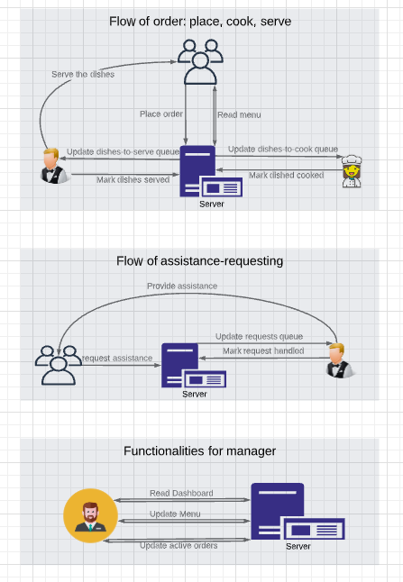
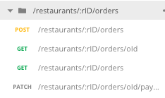

### WEEK 1

- Design a draft version for the main functions of this application
- Data stuctures of object/entities, see 'Terminology.md'
- UI, API on major functions of all roles including customer, kitchen, waiter, manager.
- A temporary task assigning to every individual for the functions mentioned above.

  > A whole-journey-contribution credit to YaoyeLu of pair-designing on almost everypart of this task
  > Contribution credit to ZitongLi for implementation of 'long connection' (He found `WebSocket` as solution and will workout a demo to help everyone understanding it.)

- Setup pages (react components) and coresponding navigation

  > so that everyone can start play around on their own page without messing up other's git record.

### week 2

BackEnd framework Setup **week2** `Jason`

1.  DB setup
2.  one Model example: `testObj`
3.  API examples:
    1.  Get `localhost:8000/api`
    2.  Get `localhost:8000/test`
    3.  Post `localhost:8000/test`

> So that everyone can
>
> - see whether their backend work normally or not.
> - copy file `api.js` as a scaffold and try to build their own api.

### Week 3

1.  Designed the interaction between modules and the flow of the system.

    

2.  Draw the UI wireframe.

> Credit to Yaoye Lu and Zitong Li for brainstroming on design.
>
> Yaoye Lu provides an solution on multiple-order-placement: when network is slow, user might click the "confirm my order" button multiple times and might place redundant orders. He suggested disabling the button untill time-out or getting response from the server.

### Week 4

1.  Build user authentication

    > Design `model`,`controller` and `router` of `User`.
    >
    > Implemented API:
    >
    > `Register: POST /api/users {name, email. password}`
    >
    > `Login: POST /api/logins`

2.  ~~Integrate OAuth~~

    > I decide that this integration should be done after RBAC be implemented

### Week 5

> 3.16-3.22

> RBAC: Role-based-access-control

1.  Design the structure of RBAC base on lib [accesscontrol](https://github.com/onury/accesscontrol)

    > Design the logic of `checkOwn` operation. It's the tricky part of setting RBAC.
    >
    > Implement RBAC on two major scope: `Administration` and `Restaurant`

2.  Implement the **authorization middleware**.

3.  Write a `readUser` as route example for "how to protect a route by RBAC".

4.  Design `model` for `restaurant`, `order`, `orderItem`, `menu`, `menuItem`.

### Week 6

> 3.23-3.28

- Restaurant CRUD
- Menu RU
- MenuItem CRUD

### week 7

> 3.29-4.4

- Category CRUD

- help Zitong Li ( Steve ) to implement websocket

- help Jiangyuan ( Annie ) to implement customer page

- upgrade/fix reference on menu <=> menuItem

### Week 8

> 4.5-4.11

- Order CRU

  - Create; create items at the same time
  - Read by Id
  - ReadMany
  - payment status update

  

> This one is relatively complicate. Bug report / reflection is writen in API design document.

> This are relatively complicate as well. Cause these functions are inevitably more coupled with other modules.

- [x] critical history record for `menuItem` and `category` ;

  > I underestimated this task a bit to be two hours.
  > It consumes around 4 hours from implement to test and commit.
  > Not including the time spend on design, which took aound 1 hour in group meeting discussion.

  - [x] replace `delete` to `archive`
  - [x] record a change history
  - [x] validate !isArchive before update data (treat archived docs like deleted)
  - [x] discriminate read-menu api between public and private

* [x] Backend - menuItem & category has status of `private` and `public`.

  > consider `archive` as private as well

* [x] API for Stuff management

  > design-implement-test together consumes two days.

  - Manger can invite user to become a staff
  - Manger can dismiss an existing staff
  - user can see his/her `currentJobs` and `pendingJobs` > `pendingJobs` can be understand as the "pending invitations of job offering"
  - user can accept ( a pending job ) and resign ( a current job )

  Illustration are filmed and uploaded to youtube

  - [dbinit and postman enviroment prepare](https://www.youtube.com/watch?v=4b4fW8dH9AE)
  - [invite, accept, dismissal](https://www.youtube.com/watch?v=dAbItl1nEQY)
  - [user accept and resign a job](https://www.youtube.com/watch?v=ciGsapYTI_A)

- [x] Populate data for dashboard usage
  > The above jobs is reallocated to Steve ( Zitong Li ).
  > I was an assistant on this, finish `users`, `restaurants`, routing, etc.
  > He finishes `order`, `orderItems`, and the rest. `orderItems` is the hard part.
  > He introduced the "dummy JSON" framework which is very powerful and convinient.

> 4.13-4.18

- [ ] `picture upload`
  > working on it

* [ ] Integrate websocket

  > These jobs are reallocated to Steve ( Zitong Li ).
  > I will be an assistant on this.

  - [ ] new order placement update
    > We deside to use `polling` rather than `event emit`.
  - [ ] new change on orderItem
  - [ ] new assistant-request update
  - [ ] push new request to waiter client
