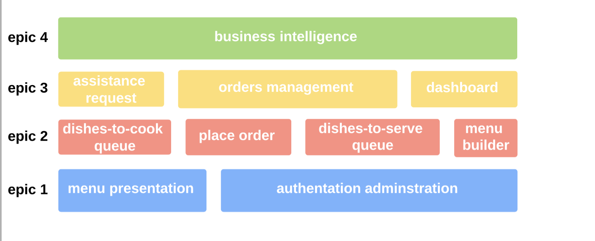
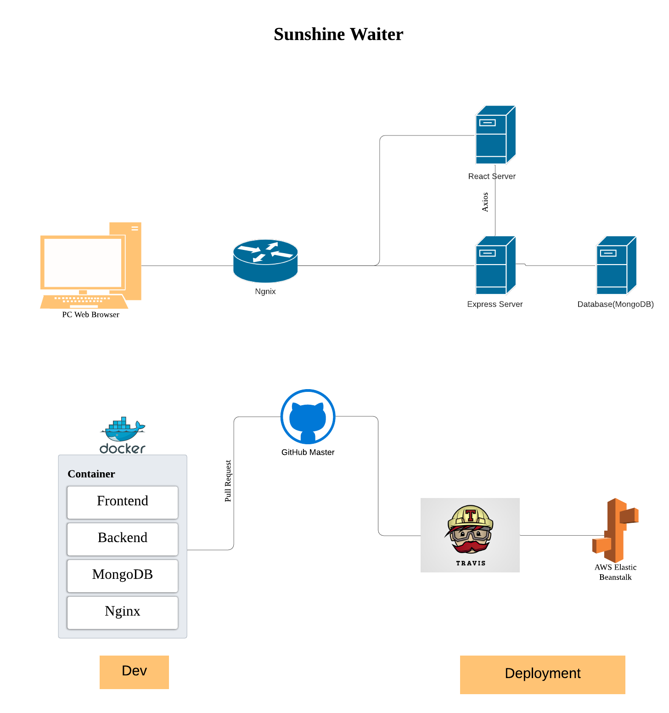
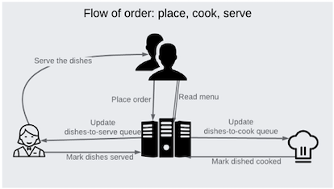
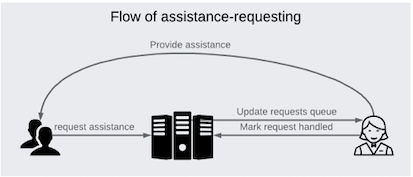
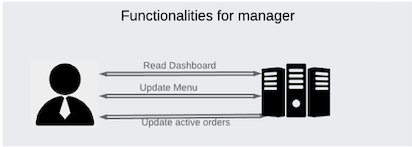
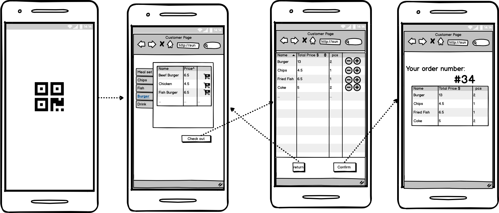
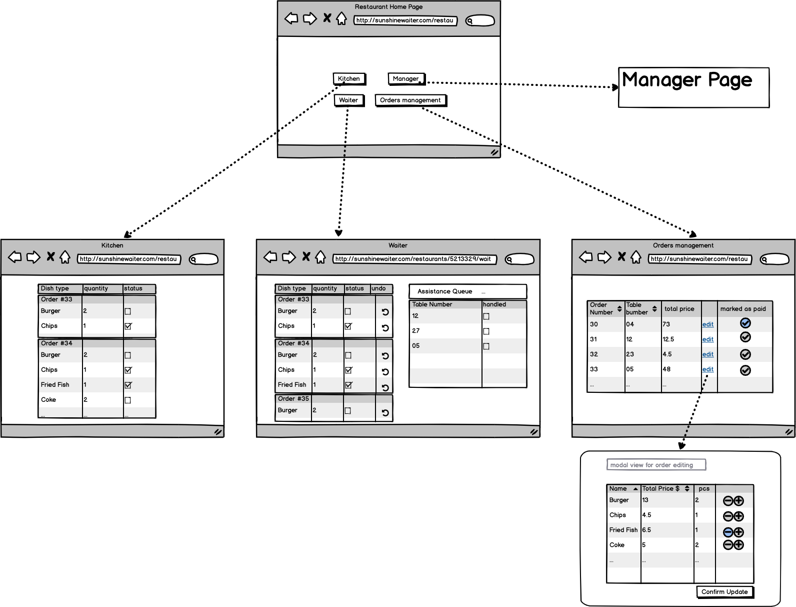
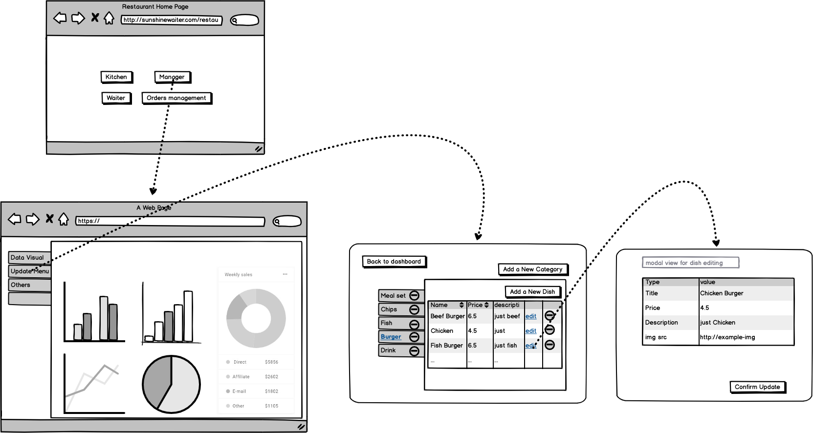

# Proposal

We choose the project 6, Waiter, as our project this term.

## Background

Many restaurants or cafes now have an increasingly demanding for an automated ordering system that allows customers to place orders online. There are plenty of advantages to providing such service:

1.  Saving time, both for the restaurants and customers.
2.  Can take care of multiple customers simultaneously, which may need extra waiters/waitresses if not using such a system.
3.  Having a database that stores all the activities data (logs) so that it can provide some insights on the business condition for the restaurant owner.

## Existing systems and their drawbacks

There are several restaurant management systems used on the market, but cannot exactly fulfil the needs of this project. The market lacks such a waiter service system that can be generally implemented by any kind of restaurants/cafes.

### 1. Yelp

Yelp is a business directory service and crowd-sourced review forum where users can leave their comments on restaurants they visited. It is a great place to find a popular restaurant.

**Drawbacks:**
However, Yelp doesn't provide an automated order service in a restaurant. Customer can't view the menu or place order online.

### 2. Mymacca's

A mobile app created by Mcdonald's for the customers so that they can view menu and place orders online without queuing.

**Drawbacks:**
The app is designed specifically for Mcdonald's customers. Other restaurant managers cannot use this system to develop their own business.

### 3. MenuDrive

This website provides a service that can transfer your traditional menu into an interactive online menu by just sending them the pictures, so no HTML or programming knowledge is required. Once the system is implemented into your restaurant, it can handle multiple order types like a pickup, delivery, curbside and dine-in.

**Drawbacks:**
Every customer who wants to order something has to sign in with his/her e-mail or other social accounts. So on the side of customers, their personal information might be used for marketing promotions like advertising and customers may also find it cumbersome because sometimes they just want a fast meal ("Why do I have to sign in just for a hot dog?").

And the visual style of its online menu is not modern enough, which might not be attractive to some users.

### 4. Toast

Toast offers a popular point of sale system for restaurants that also includes an online ordering system. This option is most suited to the restaurants that already use Toast POS. The whole system is meant to work together to help restaurants manage all of their operations in one system, to even include online order reports and delivery systems. Pricing starts at \$140 per month.

**Drawbacks:**
High pricing. Same potential problems as MenuDrive.

## Purpose of the system and features

When people go out for a meal, sometimes they need to wait for a long time to place order in peak time. Too long waiting time may make them feel frustrated and unhappy. In order to control the waiting time, the restuarant has to hire more waiters, which will increase the financial burden.

Therefore, our product "waiter" is proposed to address these issues as well as the drawbacks mentioned above in the existing competitors. we are aiming to create a useful and easy-to-use ordering system that benefits both customer and resturant.

For customers, our system provides functions of placing orders online and requesting assistance from a waiter without registration.

For restuarant, our product provides different **pages** according to different roles including waiter, kitchen staff and mananger, which is as following:

1. The page for waiter allows to get request from customer and mark as completed once it is hanlded. Besides, it allows them to deal with the prepared order from kitchen and serve it to customer.
2. The page for kitchen provides kitchen staff a time-sorted list of customer orders and allow them to mark an order item as prepared once it is ready for serving.
3. The page for manager allows to create, update, delete menu. With a menu editting tool, the manager can easily and quickly add items to site completing with high resolution images, description, pricing, category and more. And also, the manager can update the sequence of menu items or categories.

During the brainstorming, we think of many other features, including payment and marketing analysis. Due to the relative complicated implementation and time limitation, we decide to let customers go to the front counter to pay instead of paying online. Besides, the marketing analysis includes data collection and analysis, which is relative time-consuming. Therefore, this part is out of our scope.

## Epics

In this project, we have four main epics including basic, core , management and business analysis part. The structure picture is as following:

### 1. Basics

As basic part of our application, we will realize two main functions: adminstration and authentication for the resturant side, menu presentation.

### 2. Core

After defining the main structure, we will set up 4 main functions: dishes-to-cook for kitchen, order placing for customer, dishes-to-serve for waiter, menu builder for manager.

### 3. Management

After finishing the main body of the system, this epic will add three functions: assistance request from customer, orders management and dashboard for manager.

### 4. Analysis

This epic will analyse the order data to arrange work schedule more effectively and reasonably, and have a reasonable recuritment plan.

## Software architecture

### Overview of this application

This high level of this application is quite straightforward. We use nginx to route the requests from browser to React server or Express server, and use axios to make the http request and handle the CRUD operations. MongoDB is used as the database to store all the data due to its convenience and non-relational property.

### Workflow of Development and Deployment

-   The developement phase

We will follow the industrial workflow using github to host all our codes and use pull request to push our work to the master to avoid our master being contaminated.

All coding work will be run in the docker image to ease the running of the developing environment.

-   The deployment phase

This application will be hosted on AWS Elastic Beanstalk. We use travis CI to build projects and integrate service between github and AWS EB.

## Service design

### Flow of an order getting fulfilled

1. Customer places order
2. Server recieves order
3. Server maintain the dishes-to-cook queue and push update to cook page.
    > The dishes-to-cook is a time-sorted queue that cook can view and mark a dish as cooked
4. Cooks
    5. cook dishes lished on dishes-to-cook queue
    6. deliver them to ready-to-serve area
    7. mark them as cooked on dishes-to-cook queue
5. Server recieves dishes status update \(geting cooked\)
6. Server maintain the dishes-to-serve queue and push update to waiter page.
7. Waiters
    1. serve dishes listed on dishes-to-serve queue
    2. deliver them to corresponding customer
    3. mark these dishes as served
8. Server keep tracking status of all dishes. When all the dishes in one order get served, this order would be marked as served.

### Flow of an assistance-request getting fulfilled

> Very similar to _Flow of an order getting fulfilled_

1. Customer request assistance
2. Server recieves assistance-request
3. Server maintain the `request-to-handle` queue and push update to waiter page.
4. Waiters
    1. pick an request listed on `request-to-handle` queue
    2. mark it as handled
    3. go to corresponding customer and provide help

> If an customer doesn't recieve help but the request get marked as handled by mistake, he/she can simply request again.

### Functionalities for manager

Managers

-   have a dashboard showing history data of their restaurant
-   can update the menu by performing CRUD operations on categories and items.
-   update active orders such as
    -   marking orders as paid
    -   cancelation/addition on dishes in an order

## Wire frames

-   Wire frame showing customer placing an order.

-   Wire frame showing the information-architecture of restaurant-side.

    > manager-page is in next picture

-   Wire frame of manager-page

## Technical depth

We decide to utilize these framworks as tools:

-   Frontend: React + Antd + Semantic UI
-   Backend: Node.js + Express + MongoDB
-   DevOps: AWS EB + Docker + Nginx
